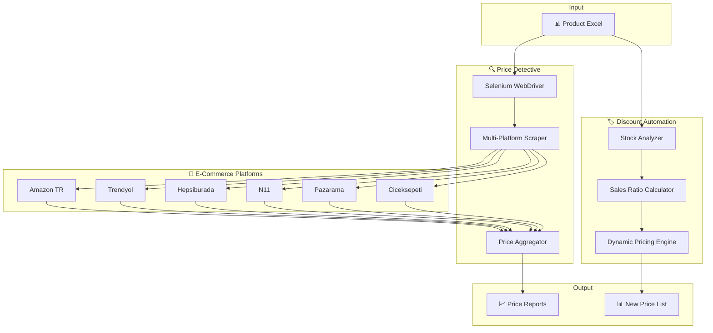

# 🤖 Algorithmic Market Intelligence RPA

### Strategic Pricing Automation for E-Commerce Operations


---

## 📌 Overview

A comprehensive **Robotic Process Automation (RPA)** system designed to scrape real-time market data, analyze competitor positioning, and autonomously adjust product pricing strategies for Turkish e-commerce platforms.

> 💡 _Automate market research. Optimize pricing. Maximize revenue._

---

## 📑 Table of Contents

- [Overview](#-overview)
- [Architecture](#%EF%B8%8F-architecture)
- [Modules](#-modules)
- [Installation](#%EF%B8%8F-installation)
- [Usage](#-usage)
- [Technical Stack](#%EF%B8%8F-technical-stack)
- [License](#%EF%B8%8F-license)

---

## 🏗️ Architecture



---

## 📦 Modules

This monorepo contains two independent automation modules:

### 🔍 [Price Detective](price-detective/)

Real-time competitor price monitoring across 6 major Turkish e-commerce platforms.

| Feature                    | Description                                                  |
| -------------------------- | ------------------------------------------------------------ |
| 🔄 Multi-Platform Scraping | Amazon TR, N11, Trendyol, Hepsiburada, Pazarama, Ciceksepeti |
| 🛡️ Anti-Detection          | Cloudflare bypass & bot protection evasion                   |
| 📊 Statistical Analysis    | Min, Average, Max price calculations                         |
| 📁 Dual Output             | TXT reports + Excel summaries                                |

```bash
cd price-detective
python price_detective.py
```

---

### 🏷️ [Discount Automation](discount-automation/)

Dynamic pricing engine based on stock levels and sales velocity.

| Stock Level  | Low Sales | Medium Sales | High Sales |
| ------------ | --------- | ------------ | ---------- |
| ≤ 3 (Low)    | 10%       | -            | 5%         |
| 4-9 (Normal) | 15%       | 10%          | 5%         |
| ≥ 10 (High)  | 30%       | 20%          | 10%        |

```bash
cd discount-automation
python automatic_discount.py
```

---

## ⚙️ Installation

### Prerequisites

| Requirement    | Version                 |
| -------------- | ----------------------- |
| Python         | 3.8+                    |
| Chrome Browser | Latest                  |
| ChromeDriver   | Matching Chrome version |

### Quick Start

```bash
# Clone the repository
git clone https://github.com/isikmuhamm/algorithmic-market-intelligence-rpa.git
cd algorithmic-market-intelligence-rpa

# Install dependencies
pip install -r requirements.txt
```

---

## 🚀 Usage

### Price Surveillance

```bash
# Navigate to price detective module
cd price-detective

# Run the scraper
python price_detective.py
```

**Input:** `urunler.xlsx` (Product list with codes and names)  
**Output:** `urunler_sonuc.xlsx` + `output/*.txt`

### Automatic Discounting

```bash
# Navigate to discount automation module
cd discount-automation

# Run the pricing engine
python automatic_discount.py
```

**Input:** `urun_satis_adetleri_oranlari_stoklari.xlsx`  
**Output:** `yeni_satis_fiyatlari.xlsx`

---

## 🛠️ Technical Stack

| Category            | Technologies                           |
| ------------------- | -------------------------------------- |
| **Core Logic**      | Python 3.8+                            |
| **Web Automation**  | Selenium WebDriver (Headless Chrome)   |
| **Data Extraction** | BeautifulSoup4, Requests               |
| **Data Processing** | Pandas, OpenPyXL                       |
| **Anti-Detection**  | User-Agent rotation, Cloudflare bypass |

### Key Capabilities

| Capability                  | Description                                                                        |
| --------------------------- | ---------------------------------------------------------------------------------- |
| 🔄 **Polymorphic Scraping** | Handles static (Amazon, N11) and dynamic JS-rendered (Trendyol, Hepsiburada) pages |
| 🤖 **Autonomous Decisions** | Evaluates sales velocity vs. stock to trigger automatic discounts                  |
| 🌐 **Cross-Platform**       | Unified tracking across fragmented marketplaces                                    |

---

## ⚖️ License

This project is licensed under the **MIT License**.

---

<div align="center">

**Designed & Developed by [@isikmuhamm](https://github.com/isikmuhamm)**

_Intelligent automation for competitive e-commerce_ 🚀

[](https://github.com/isikmuhamm)

</div>
