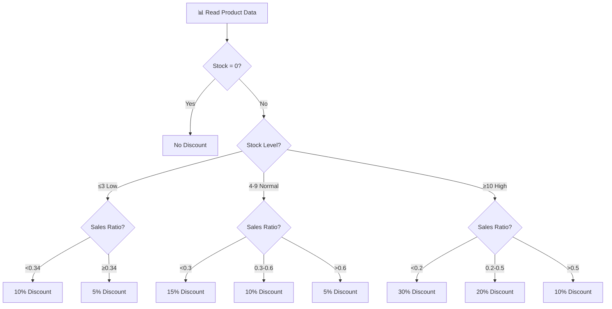

# 🏷️ Automatic Discount Calculator

### Dynamic Pricing Engine Based on Stock & Sales Analytics


---

## 📌 Overview

This Python script implements a **dynamic pricing algorithm** that automatically calculates discounts based on product stock levels and sales ratios. It reads product data from an Excel file, applies intelligent discount rules, and exports the results with new prices and applied discount rates.

> 💡 _Optimize your inventory. Maximize revenue. Automate pricing decisions._

---

## 📑 Table of Contents

- [Overview](#-overview)
- [Algorithm](#-algorithm)
- [Installation](#%EF%B8%8F-installation)
- [Usage](#-usage)
- [Technical Implementation](#%EF%B8%8F-technical-implementation)
- [Examples](#-examples)
- [Development](#-development)
- [License](#%EF%B8%8F-license)

---

## 🏗️ Algorithm



### Discount Strategy Matrix

| Stock Level      | Sales Ratio | Discount |
| ---------------- | ----------- | -------- |
| ≤ 3 (Low)        | < 0.34      | 10%      |
| ≤ 3 (Low)        | ≥ 0.34      | 5%       |
| 4-9 (Normal)     | < 0.3       | 15%      |
| 4-9 (Normal)     | 0.3 - 0.6   | 10%      |
| 4-9 (Normal)     | ≥ 0.6       | 5%       |
| ≥ 10 (High)      | < 0.2       | 30%      |
| ≥ 10 (High)      | 0.2 - 0.5   | 20%      |
| ≥ 10 (High)      | ≥ 0.5       | 10%      |
| 0 (Out of Stock) | Any         | 0%       |

### Sales Ratio Formula

```
Sales Ratio = Sales Quantity / (Sales Quantity + Stock Quantity)
```

This ratio normalizes product performance relative to available inventory.

---

## ⚙️ Installation

### Prerequisites

| Requirement | Version |
| ----------- | ------- |
| Python      | 3.8+    |
| pandas      | Latest  |
| openpyxl    | Latest  |

### Quick Start

```bash
# Install dependencies
pip install pandas openpyxl

# Clone repository
git clone https://github.com/isikmuhamm/ceporjin-eticaret-fiyat-yonetimi.git
cd ceporjin-eticaret-fiyat-yonetimi/indirim-otomasyonu
```

---

## 🚀 Usage

### Running the Application

```bash
python automatic_discount.py
```

### Input File Structure

The Excel file (`urun_satis_adetleri_oranlari_stoklari.xlsx`) must have these columns:

| Column        | Description                              | Type    |
| ------------- | ---------------------------------------- | ------- |
| `Urun_Kodu`   | Product code                             | String  |
| `Urun_Adi`    | Product name                             | String  |
| `Satis_Fiyat` | Current sale price                       | Float   |
| `Satis_Adedi` | Total sales quantity                     | Integer |
| `Satis_Orani` | Sales ratio (auto-calculated if missing) | Float   |
| `Stok_Adedi`  | Current stock quantity                   | Integer |

---

## 🛠️ Technical Implementation

### Core Function

```python
def calculate_new_price_and_discount(row):
    """
    Calculates new price and discount rate based on stock and sales data.

    Args:
        row: DataFrame row containing product data

    Returns:
        tuple: (new_price, discount_rate)
    """
```

### Dependencies

| Package    | Purpose                            |
| ---------- | ---------------------------------- |
| `pandas`   | DataFrame operations and Excel I/O |
| `openpyxl` | Excel file read/write support      |
| `os`       | Cross-platform file path handling  |

### File Structure

```
indirim-otomasyonu/
│
├── 🐍 automatic_discount.py           # Main discount calculator
├── 📥 urun_satis_adetleri_oranlari_stoklari.xlsx  # Input file
└── 📤 yeni_satis_fiyatlari.xlsx       # Output file
```

---

## 📋 Examples

### Sample Input

| Urun_Kodu | Urun_Adi  | Satis_Fiyat | Satis_Adedi | Satis_Orani | Stok_Adedi |
| --------- | --------- | ----------- | ----------- | ----------- | ---------- |
| 001       | Product A | 100         | 20          | 0.4         | 5          |
| 002       | Product B | 150         | 0           | 0.0         | 12         |

### Sample Output

| Urun_Kodu | Urun_Adi  | Satis_Fiyat | Satis_Adedi | Satis_Orani | Stok_Adedi | Yeni_Fiyat | Yapilan_Indirim |
| --------- | --------- | ----------- | ----------- | ----------- | ---------- | ---------- | --------------- |
| 001       | Product A | 100         | 20          | 0.4         | 5          | 90         | 0.10            |
| 002       | Product B | 150         | 0           | 0.0         | 12         | 105        | 0.30            |

---

## 🔮 Development

### Customization

You can modify the discount thresholds in `calculate_new_price_and_discount()` function to match your business requirements.

---

## ⚖️ License

This project is licensed under the **MIT License**.

---

<div align="center">

**Designed & Developed by [@isikmuhamm](https://github.com/isikmuhamm)**

_Intelligent pricing automation for e-commerce_ 🏷️

</div>
