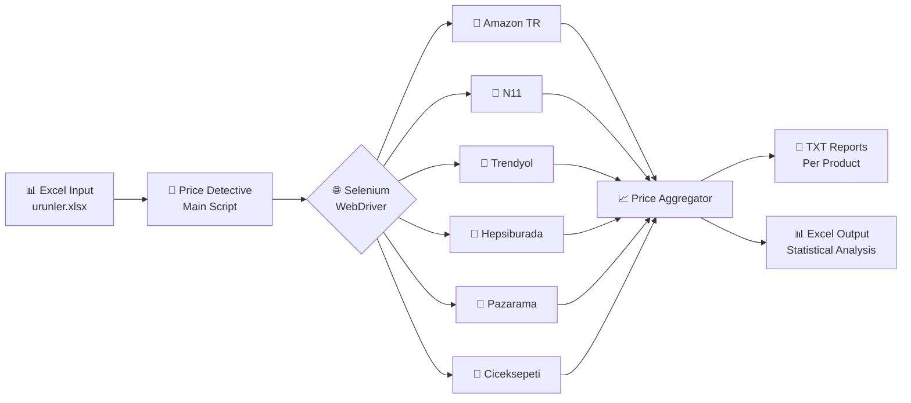

# 🔍 Price Detective

### Competitor Price Monitoring & Market Intelligence System


---

## 📌 Overview

**Price Detective** is an automated **RPA (Robotic Process Automation)** tool designed for real-time competitor price monitoring and analysis across major Turkish e-commerce platforms. It empowers businesses to make data-driven pricing decisions by aggregating and analyzing market prices at scale.

> 💡 _Automate your market research. Stay competitive. Save hours of manual work._

---

## 📑 Table of Contents

- [Overview](#-overview)
- [Architecture](#%EF%B8%8F-architecture)
- [Features](#-features)
- [Installation](#%EF%B8%8F-installation)
- [Usage](#-usage)
- [Technical Implementation](#%EF%B8%8F-technical-implementation)
- [Examples](#-examples)
- [Development](#-development)
- [License](#%EF%B8%8F-license)

---

## 🏗️ Architecture



### Project Structure

```
fiyat-dedektifi/
│
├── 🔧 browser_setup.py      # WebDriver initialization & Cloudflare bypass
├── 🕷️ price_scraper.py       # Platform-specific scraping logic
├── 🚀 price_detective.py     # Main application orchestrator
├── 📥 urunler.xlsx           # Input: Product list
├── 📤 urunler_sonuc.xlsx     # Output: Price analysis results
└── 📁 output/
    └── *.txt                 # Detailed per-product reports
```

---

## ⚡ Features

| Feature                        | Description                                                 |
| ------------------------------ | ----------------------------------------------------------- |
| 🔄 **Multi-Platform Scraping** | Simultaneously scrapes 6 major Turkish e-commerce platforms |
| 🛡️ **Anti-Detection**          | Built-in Cloudflare bypass and bot protection evasion       |
| 📊 **Statistical Analysis**    | Calculates Min, Average, and Max prices per platform        |
| 📁 **Dual Output Format**      | Exports both detailed TXT reports and Excel summaries       |
| 🎯 **Headless Operation**      | Runs without GUI for server deployment                      |
| 💰 **Turkish Price Parsing**   | Native support for Turkish number formatting (1.234,56 TL)  |

---

## ⚙️ Installation

### Prerequisites

| Requirement    | Version                 |
| -------------- | ----------------------- |
| Python         | 3.8+                    |
| Chrome Browser | Latest                  |
| ChromeDriver   | Matching Chrome version |

### Dependencies

```bash
pip install pandas beautifulsoup4 selenium openpyxl
```

| Package          | Purpose                                |
| ---------------- | -------------------------------------- |
| `pandas`         | Data manipulation and Excel I/O        |
| `beautifulsoup4` | HTML parsing and data extraction       |
| `selenium`       | Browser automation for dynamic content |
| `openpyxl`       | Excel file read/write support          |

### Quick Start

```bash
# Clone the repository
git clone https://github.com/isikmuhamm/ceporjin-eticaret-fiyat-yonetimi.git

# Navigate to project directory
cd ceporjin-eticaret-fiyat-yonetimi/fiyat-dedektifi

# Install dependencies
pip install -r requirements.txt
```

---

## 🚀 Usage

### Running the Application

```bash
python price_detective.py
```

### Workflow

1. **Prepare Input**: Add products to `urunler.xlsx` with columns `Urun_Adi` (name) and `Urun_Kodu` (code)
2. **Execute**: Run the script
3. **Collect Results**: Check `output/` folder for detailed reports and `urunler_sonuc.xlsx` for summary

### Input Format

| Column      | Description         | Example             |
| ----------- | ------------------- | ------------------- |
| `Urun_Adi`  | Product search term | `iPhone 15 Pro Max` |
| `Urun_Kodu` | Unique identifier   | `IPHONE15PM`        |

---

## 🛠️ Technical Implementation

### Core Modules

#### `browser_setup.py`

| Function               | Description                                             |
| ---------------------- | ------------------------------------------------------- |
| `setup_driver()`       | Initializes headless Chrome with anti-detection headers |
| `wait_for_page_load()` | Handles page load states and Cloudflare verification    |

#### `price_scraper.py`

| Function               | Target Platform                 |
| ---------------------- | ------------------------------- |
| `search_amazon()`      | Amazon Turkey                   |
| `search_n11()`         | N11                             |
| `search_trendyol()`    | Trendyol                        |
| `search_pazarama()`    | Pazarama                        |
| `search_ciceksepeti()` | Ciceksepeti                     |
| `search_hepsiburada()` | Hepsiburada                     |
| `get_results()`        | Aggregates all platform results |

#### `price_detective.py`

| Function             | Description                                          |
| -------------------- | ---------------------------------------------------- |
| `calculate_prices()` | Parses Turkish price format, returns (min, avg, max) |
| Main Loop            | Orchestrates scraping and export workflow            |

### Supported Platforms

| Platform       | Base URL          | Sort Strategy   |
| -------------- | ----------------- | --------------- |
| 🟠 Amazon TR   | `amazon.com.tr`   | Price Ascending |
| 🟣 N11         | `n11.com`         | Price Low       |
| 🟠 Trendyol    | `trendyol.com`    | Price Ascending |
| 🔵 Pazarama    | `pazarama.com`    | Price Ascending |
| 🌸 Ciceksepeti | `ciceksepeti.com` | Default         |
| 🟠 Hepsiburada | `hepsiburada.com` | Price Ascending |

### Price Parsing Logic

```python
# Turkish Format: 1.234,56 TL → 1234.56
clean_price = raw_price.replace('.', '')      # Remove thousand separator
                       .replace(',', '.')      # Convert decimal separator
                       .replace(' TL', '')     # Remove currency
```

---

## 📋 Examples

### Sample Input (`urunler.xlsx`)

| Urun_Adi             | Urun_Kodu |
| -------------------- | --------- |
| Samsung Galaxy S24   | SGS24     |
| Apple MacBook Air M3 | MBA-M3    |

### Sample Output

#### Detailed Report (`output/SGS24.txt`)

```
Product Code: SGS24
Product Name: Samsung Galaxy S24

Amazon Results:
Samsung Galaxy S24 128GB: 42.999 TL
Samsung Galaxy S24 256GB: 47.999 TL

N11 Results:
Samsung Galaxy S24: 41.500 TL

Trendyol Results:
Samsung Galaxy S24 128GB: 40.999 TL
...
```

#### Summary Report (`urunler_sonuc.xlsx`)

| Urun_Adi           | Amazon Min | Amazon Avg | Amazon Max | N11 Min | N11 Avg | N11 Max | ... |
| ------------------ | ---------- | ---------- | ---------- | ------- | ------- | ------- | --- |
| Samsung Galaxy S24 | 42999      | 45499      | 47999      | 41500   | 41500   | 41500   | ... |

---

## 🔮 Development

Contributions are welcome! Feel free to:

- 🐛 Report bugs
- 💡 Suggest features
- 🔧 Submit pull requests

---

## ⚖️ License

This project is licensed under the **MIT License** - see the [LICENSE](LICENSE) file for details.

```
MIT License

Copyright (c) 2024

Permission is hereby granted, free of charge, to any person obtaining a copy
of this software and associated documentation files (the "Software"), to deal
in the Software without restriction...
```

---

<div align="center">

**Designed & Developed by [@isikmuhamm](https://github.com/isikmuhamm)**

_Building intelligent automation for competitive advantage_ 🚀

[](https://github.com/isikmuhamm)

</div>
